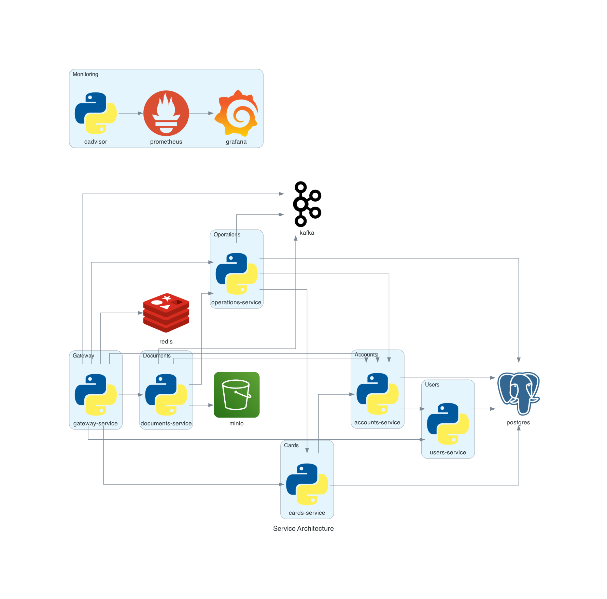

# Performance Testing Stand

This project implements a full-featured **educational banking platform** designed specifically for use in
the course [Нагрузочное тестирование на Python](https://stepik.org/course/242935/promo).

The stand simulates a realistic microservice architecture and is intended for testing, debugging, and performance
validation in a controlled training environment.

---

## Features

- Microservice-based banking system
- API available via both **HTTP** and **gRPC**
- Integrated observability stack: **Prometheus**, **Grafana**, **cAdvisor**
- Event-driven architecture via **Kafka**
- Test data storage in **PostgreSQL**, **Redis**, and **MinIO**
- Pre-configured for use with tools like **Locust**, **Postman**, **grpcurl**, etc.

---

## Technologies Used

| Component      | Purpose                          |
|----------------|----------------------------------|
| **Kafka**      | Async event-driven communication |
| **Redis**      | Caching layer                    |
| **PostgreSQL** | Persistent storage per service   |
| **MinIO**      | Object storage (e.g., documents) |
| **Prometheus** | Metrics collection               |
| **Grafana**    | Visualization of metrics         |
| **gRPC**       | High-performance RPC API         |
| **HTTP**       | REST API via HTTP gateway        |

---

## Getting Started

> Requirements: Docker & Docker Compose installed

### 1. Clone the repository

```bash
git clone https://github.com/Nikita-Filonov/performance-qa-engineer-course.git
cd performance-qa-engineer-course
```

### 2. Generate gRPC/Protobuf code

This project uses `.proto` files to define gRPC services and gateway interfaces.

```bash
./scripts/proto.sh
```

> Make sure you have protoc and necessary plugins installed. See [scripts/proto.sh](./scripts/protos.sh) for details.

### 3. Build base image

To avoid repeated setup across all microservices, a shared base image is used:

```bash
docker build -f Dockerfile.base -t base-service .
```

### 4. Launch the stand

This will build and launch all services:

```bash
docker compose up --build
```

By default, services will be available at:

- HTTP gateway: http://localhost:8003
- gRPC gateway: localhost:9003
- Grafana: http://localhost:3002
- Kafka UI: http://localhost:8081
- MinIO: http://localhost:3000
- Postgres Admin: http://localhost:5050

## Architecture



## Notes

- The stand is not intended for production use.
- Services may be simplified or instrumented specifically for teaching and testing purposes.
- Performance characteristics may vary between environments.